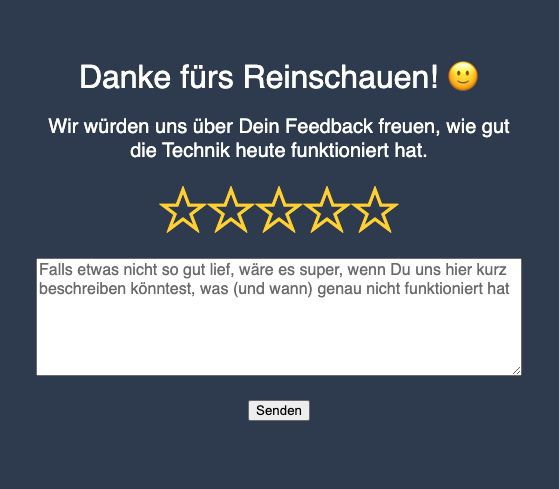

# About
Jitsi comes with a feature, which allows users to give feedback about their call experience. However, unfortunately this out-of-the-box mechanism works only in combination with CallStats, which we don't want to use due to privacy concerns.

Since we still wanted to visualize our users' satisfaction with our Jitsi instance, we instead wrote a little HTML5 page, which is shown after the user exited a meeting.
This repository mainly provides a Node.js-based REST-Endpoint to receive the user feedback and writes it as a JSON object into a local file (which then could be processed further - e.g. for visualization in a Grafana Dashboard).

 

So far it is only a kind of quick'n'dirty hack, but feel free to use it if you like it.

## Installation instructions
1. First place the file public/close3.html in the webserver document root (usually `/usr/share/jitsi-meet/static/close3.html`)

2. Create a systemd service unit for starting the REST-Service (in this case we use a hardened docker container) in `/etc/systemd/system/jitsi-feedback-api.service`:
```
[Unit]
Description=Provides (Jitsi) feedback API Service
After=docker.service
Requires=docker.service

[Service]
Type=oneshot
RemainAfterExit=yes
TimeoutStartSec=0
ExecStartPre=-/usr/bin/docker stop jitsi-feedback-api
ExecStartPre=-/usr/bin/docker rm jitsi-feedback-api
ExecStop=/usr/bin/docker stop jitsi-feedback-api
ExecStart=/usr/bin/docker run --rm -d -p 127.0.0.1:3000:3000  --name jitsi-feedback-api -v /var/lib/jitsi/feedbacks.txt:/home/node/data/feedbacks.txt --cap-drop all --read-only --security-opt=no-new-privileges stean/feedback-api:version-1.0
# for debugging output
# ExecStart=/usr/bin/docker run --rm -d -p 127.0.0.1:3000:3000 --env NODE_ENV=development --name jitsi-feedback-api -v /var/lib/jitsi/feedbacks.txt:/home/node/data/feedbacks.txt --cap-drop all --read-only --security-opt=no-new-privileges stean/feedback-api:version-1.0

[Install]
WantedBy=multi-user.target
```

3. Start the service and make it reboot resistant
`systemctl daemon-reload; systemctl start jitsi-feedback-api; systemctl enable jitsi-feedback-api`

4. Create the result file and adjust the file permissions accordingly
`touch /var/lib/jitsi/feedbacks.txt; chmod o+w`

    Note: The result file should be stored somewhere outsite of the document root!

5. Adjust your nginx webserver configuration to relay the REST endpoint at the preferred URL
```
location /api/ {
  proxy_pass http://localhost:3000;
}
```

6. Enable the page by setting the properties `SHOW_PROMOTIONAL_CLOSE_PAGE` in interface_config.js and `enableClosePage` in config.js to `true`.
